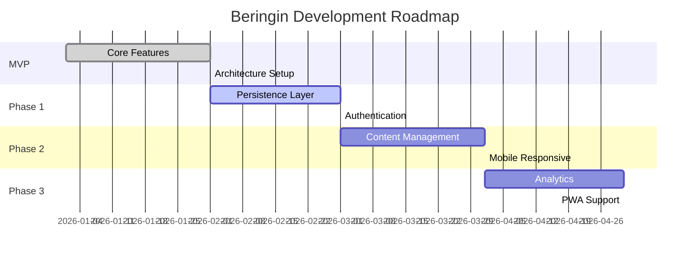

# 🗺️ Roadmap - Beringin

> Rencana pengembangan dari MVP ke aplikasi final

## 📅 Timeline Overview



---

## ✅ Phase 0: MVP (DONE)

**Goal**: Proof of concept dengan fitur inti

| Feature            | Status | Description                                    |
| ------------------ | ------ | ---------------------------------------------- |
| Study Session      | ✅     | Self-grading dengan confidence levels          |
| Dashboard          | ✅     | Concept status monitoring                      |
| Adaptive Scheduler | ✅     | SM-2 based algorithm                           |
| Clean Architecture | ✅     | Layered architecture dengan ESLint enforcement |

---

## 🔄 Phase 1: Foundation (Current)

**Goal**: Persistent storage dan user management

### 1.1 Persistence Layer

```
[ ] Migrate in-memory → localStorage
[ ] Add Supabase integration
[ ] Implement sync mechanism
[ ] Add offline support
```

### 1.2 Authentication

```
[ ] Supabase Auth integration
[ ] Email/password login
[ ] OAuth (Google)
[ ] Protected routes
```

### 1.3 Quality Improvements

```
[x] ESLint architecture rules
[x] CI/CD pipeline
[ ] Fix remaining test failures
[ ] E2E tests dengan Playwright
```

---

## 📦 Phase 2: Content Management

**Goal**: CRUD untuk konsep dan pertanyaan

### 2.1 Admin Panel

```
[ ] Concept CRUD UI
[ ] Question CRUD UI
[ ] Bulk import (JSON/CSV)
[ ] Category management
```

### 2.2 Enhanced Learning

```
[ ] Multiple question types (MCQ, fill-blank)
[ ] Rich text support (Markdown)
[ ] Image attachments
[ ] Audio pronunciation
```

### 2.3 Mobile Experience

```
[ ] Responsive design audit
[ ] Touch gestures (swipe to answer)
[ ] Mobile navigation
[ ] Dark mode
```

---

## 📊 Phase 3: Analytics & Insights

**Goal**: Data-driven learning improvements

### 3.1 Learning Analytics

```
[ ] Study streak tracking
[ ] Time spent analytics
[ ] Retention rate graphs
[ ] Difficult concept identification
```

### 3.2 Smart Features

```
[ ] AI-generated hints
[ ] Similar concept suggestions
[ ] Optimal study time recommendations
[ ] Forgetting curve visualization
```

### 3.3 PWA & Notifications

```
[ ] Service worker setup
[ ] Push notifications for due reviews
[ ] Add to home screen
[ ] Background sync
```

---

## 🎯 Final Vision

### Target Application

```
┌─────────────────────────────────────────────────────────┐
│                    🌳 Beringin v1.0                     │
├─────────────────────────────────────────────────────────┤
│                                                         │
│  ┌─────────────┐  ┌─────────────┐  ┌─────────────┐     │
│  │   Study     │  │  Dashboard  │  │   Admin     │     │
│  │   Session   │  │  Analytics  │  │   Panel     │     │
│  └─────────────┘  └─────────────┘  └─────────────┘     │
│                                                         │
│  ┌─────────────────────────────────────────────────┐   │
│  │              Adaptive Scheduler                  │   │
│  │         (ML-enhanced spaced repetition)         │   │
│  └─────────────────────────────────────────────────┘   │
│                                                         │
│  ┌─────────────┐  ┌─────────────┐  ┌─────────────┐     │
│  │  Supabase   │  │   Auth      │  │   PWA       │     │
│  │  Database   │  │  (OAuth)    │  │  Offline    │     │
│  └─────────────┘  └─────────────┘  └─────────────┘     │
│                                                         │
└─────────────────────────────────────────────────────────┘
```

### Key Differentiators

1. **Confidence-based Scheduling** - Tidak hanya benar/salah, tapi juga seberapa yakin
2. **Clean Architecture** - Maintainable dan testable codebase
3. **Indonesian-first** - UI dan UX untuk pengguna Indonesia
4. **Self-hosted Option** - Deploy sendiri dengan Supabase

---

## 📋 Backlog (Future Considerations)

- [ ] Multi-language support
- [ ] Collaborative decks
- [ ] Spaced repetition for long-form content
- [ ] Integration dengan Notion/Obsidian
- [ ] API untuk third-party apps
- [ ] Gamification (achievements, leaderboard)

---

_Lihat [CURRENT_STATE.md](./CURRENT_STATE.md) untuk status terkini._
